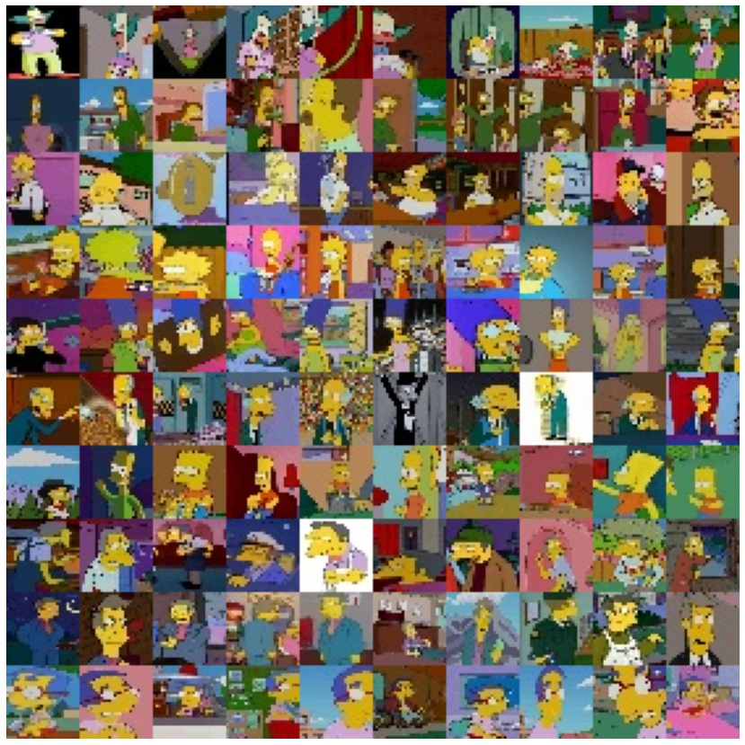
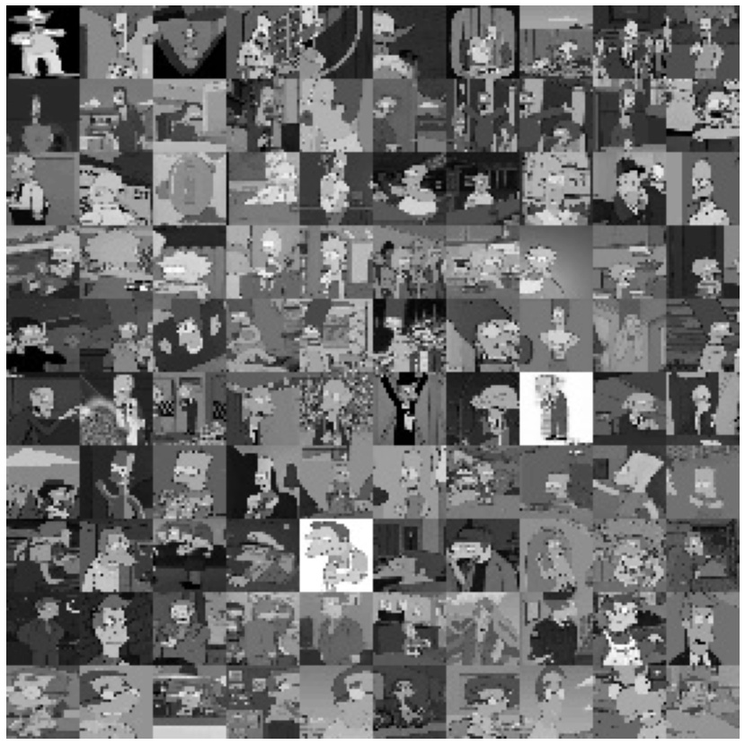

# Simpsons-MNIST

`Simpsons-MNIST` is a small dataset of The Simpsons characters - consisting of a training set of 8,000 examples
and a test set of 2,000 examples. Each example is a 28x28 RGB/grayscale image, associated with a label from 10 classes.
This is a __small MNIST__ as it does not contain 60,000 training and 10,000 testing examples, since there's not 
that much data in the original dataset. This dataset is available in both formats, RGB and grayscale, in RGB as
some of The Simpsons features are based on color, and the grayscale one, so as to be as similar as possible to the
original MNIST. Anyway, this MNIST is intended to be used with __educational purposes__ as it is small and dirty 
which means that you can train a neural network using this dataset from almost any computer, and
also this can serve as a replacement of all the other well known MNIST datasets as it is not as boring as the
rest of MNIST datasets, both the [Google's original MNIST](https://github.com/google/n-digit-mnist), 
and the other derivate MNIST-like dataset as: [Zalando's Fashion-MNIST](https://github.com/zalandoresearch/fashion-mnist), 
[ROIS-DS Center for Open Data in the Humanities Kuzushiji-MNIST](https://github.com/rois-codh/kmnist), and some
more created by the open source community.

Here's an example on how the data looks lke:

 RGB | Grayscaled
:---:|:----------:
 | 

---

## About the data

The RGB dataset contains the following information:

|            Name |   Set |      Size | \# Images | Download URL
|-----------------|-------|-----------|-----------|--------------
| `rgb-train.zip` | Train | 12 MBytes |     8,000 | [RGB Train](https://www.dropbox.com/s/as1q6851qgm7zif/rgb-train.zip)
|  `rgb-test.zip` |  Test |  3 MBytes |     2,000 | [RGB Test](https://www.dropbox.com/s/orz1uxkpxzevpkk/rgb-test.zip)

And, the grayscaled dataset contains the following information:

|                  Name |   Set |      Size | \# Images |     Download URL
|-----------------------|-------|-----------|-----------|------------------
| `grayscale-train.zip` | Train |  8 MBytes |     8,000 | [Grayscale Train](https://www.dropbox.com/s/6s3wh1err59j01j/grayscale-train.zip)
|  `grayscale-test.zip` |  Test |  2 MBytes |     2,000 | [Grayscale Test](https://www.dropbox.com/s/nuhkoxqlaxrxa5o/grayscale-test.zip)

And the labels for both datasets are the following ones:

```json
{
  "bart_simpson": 0,
  "charles_montgomery_burns": 1,
  "homer_simpson": 2,
  "krusty_the_clown": 3,
  "lisa_simpson": 4,
  "marge_simpson": 5,
  "milhouse_van_houten": 6,
  "moe_szyslak": 7,
  "ned_flanders": 8,
  "principal_skinner": 9
}
```

As an alternative solution you can just clone the repository as both dataset are included under the `dataset/`
directory. To do so you just need to: `git clone git@github.com:alvarobartt/simpsons-mnist.git`

---

## Load the data

Here you have some examples on how to load the data (both RGB and grayscale):

- [Load the data with TensorFlow](examples/tensorflow/)
- [Load the data with PyTorch](examples/pytorch/)
- [Load the data with PyTorch Lightning](examples/pytorch_lightning/)

---

## Credits

The original dataset of The Simpsons Characters was created by [Alexandre Attia](https://github.com/alexattia) in the
following Kaggle [dataset's page](https://www.kaggle.com/alexattia/the-simpsons-characters-dataset).