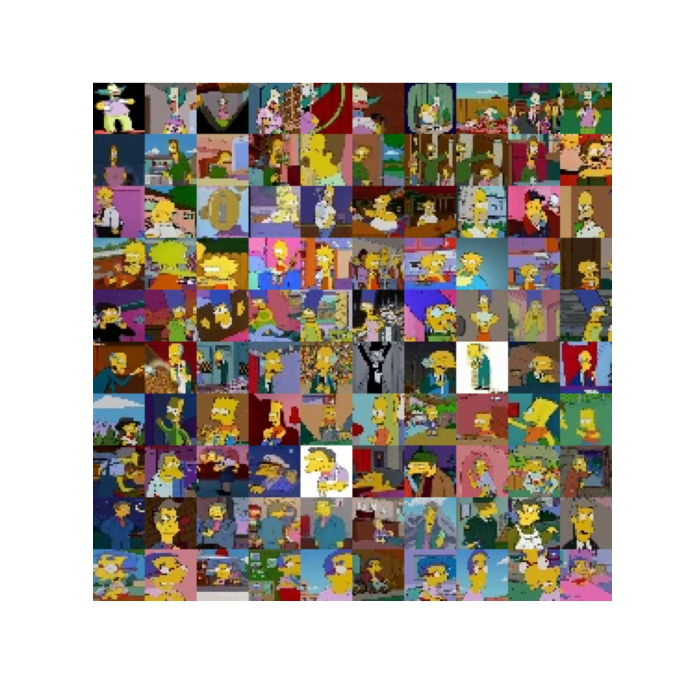
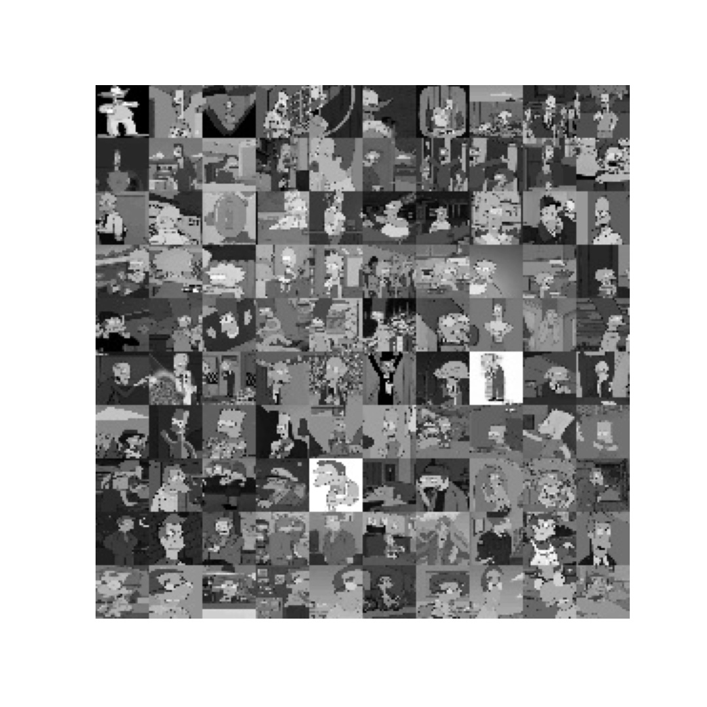

# Simpsons-MNIST

---

`Simpsons-MNIST` is a small dataset of The Simpsons characters - consisting of a training set of 8,000 examples
and a test set of 2,000 examples. Each example is a 28x28 RGB/grayscale image, associated with a label from 10 classes.
This is a __small MNIST__ as it does not contain 60,000 training and 10,000 testing examples, since there's not 
that much data in the original dataset. This dataset is available in both formats, RGB and grayscale, in RGB as
some of The Simpsons features are based on color, and the grayscale one, so as to be as similar as possible to the
original MNIST. Anyway, this MNIST is intended to be used with __educational purposes__ as it is small and dirty 
which means that you can train a neural network using this dataset from almost any computer, and
also this can serve as a replacement of all the other well known MNIST datasets as it is not as boring as the
rest of MNIST datasets, both the [Google's original MNIST](https://github.com/google/n-digit-mnist), 
and the other derivate MNIST-like dataset as: [Zalando's Fashion-MNIST](https://github.com/zalandoresearch/fashion-mnist), 
[ROIS-DS Center for Open Data in the Humanities Kuzushiji-MNIST](https://github.com/rois-codh/kmnist), and some
more created by the open source community.

Here's an example on how the data looks in RGB format:

,bbox_inches='tight'

Here's an example on how the data looks in grayscale format:

,bbox_inches='tight'

---

## About the data

bla bla bla

RGB

| Set | Size (in MB) | \# Images | Download URL
|-----|--------------|-----------|------
| Train | 12 | 8,000 | [RGB Train]()
| Test | 3 | 2,000 | [RGB Test]()

Grayscale

| Set | Size (in MB) | \# Images | Download URL
|-----|--------------|-----------|------
| Train | 8 | 8,000 | [Grayscale Train]()
| Test | 2 | 2,00 | [Grayscale Test]()

---

## Load the data

bla bla bla

---

## Credits

bla bla bla
